In order to get mySQL connection working you may need to have the mySQL Connector as an external library
Here is how to get it for IntelliJ 2019

https://www.youtube.com/watch?v=T5Hey0e2Y_g

Download the JAR here and select platform independent
https://dev.mysql.com/downloads/connector/j/

Diagrams
-------------------------------------------------------------------------

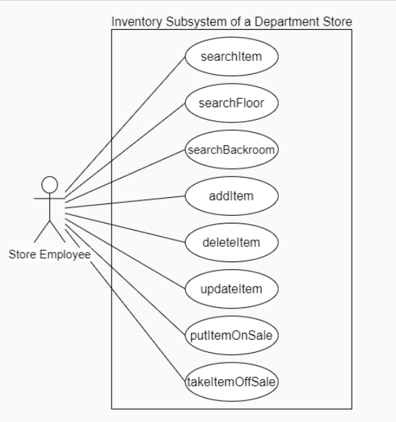
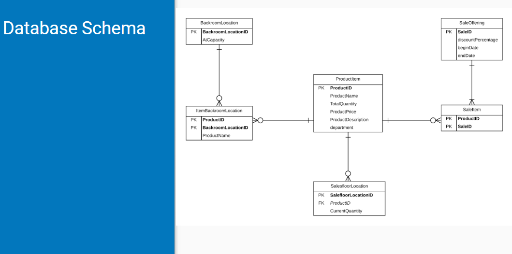
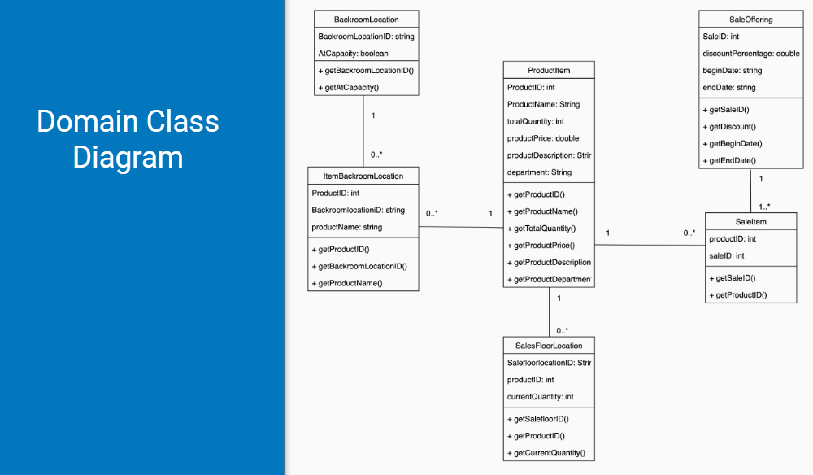
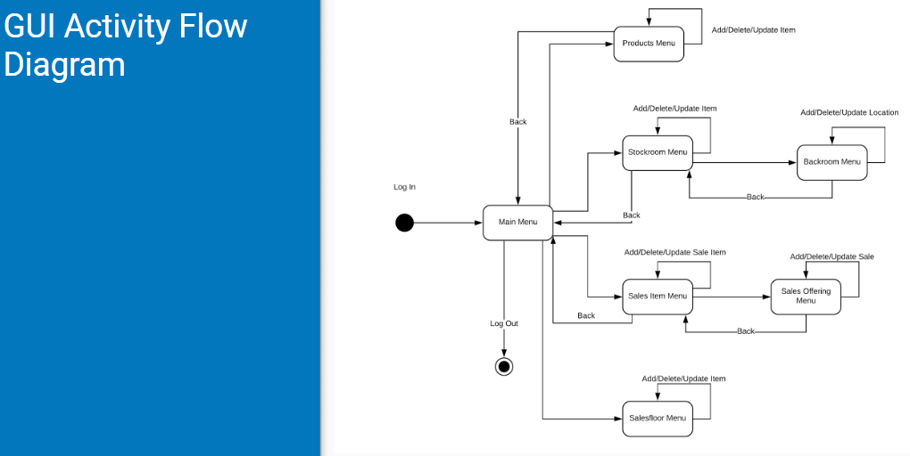
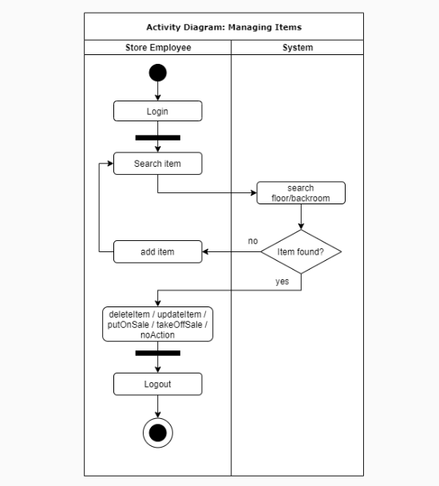

How the program looks 
-------------------------------------------------------------------------
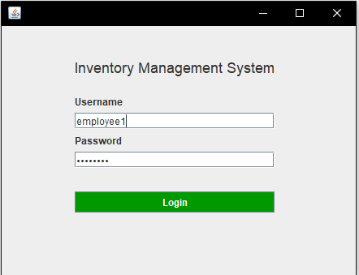
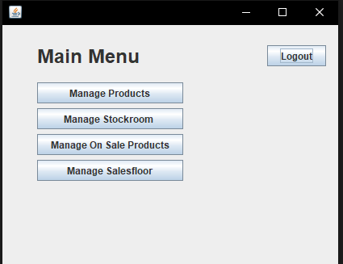
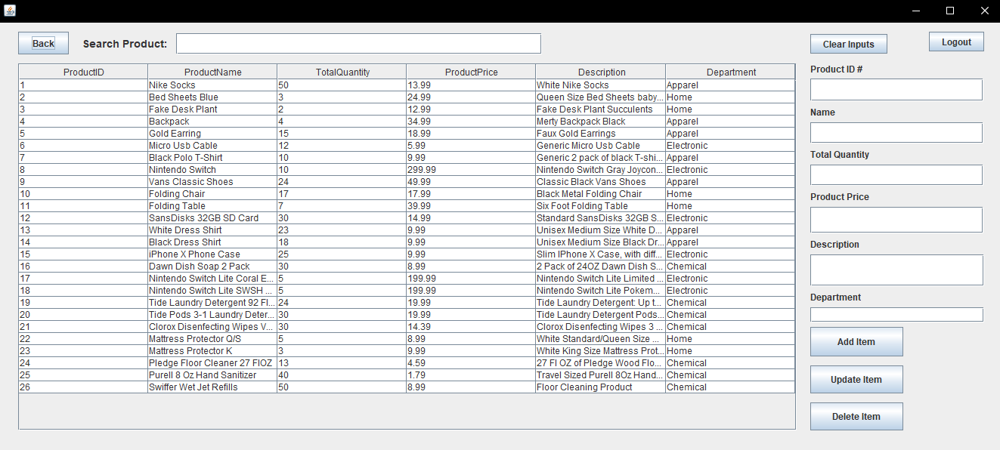
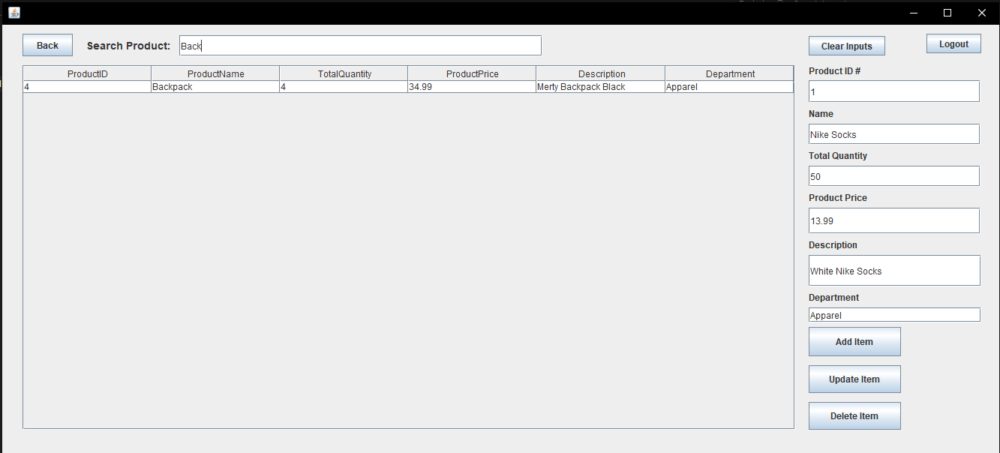

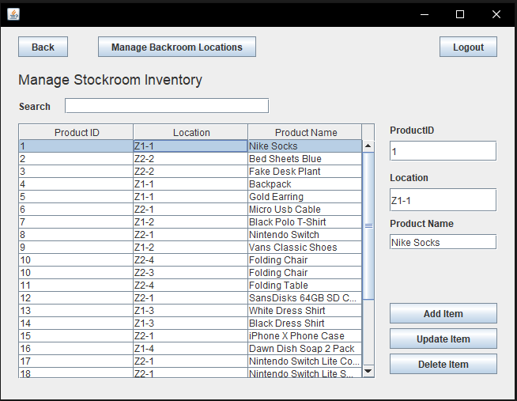
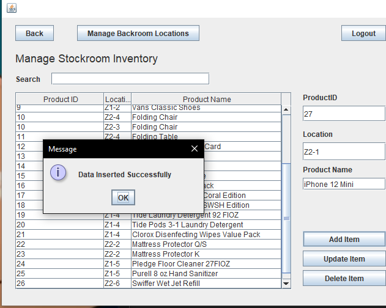
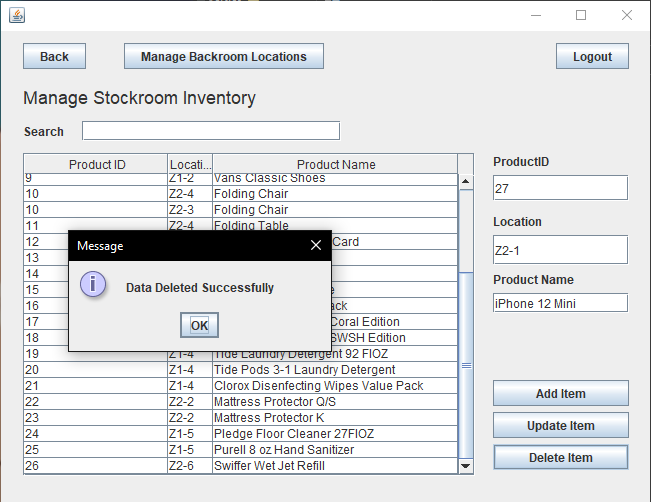
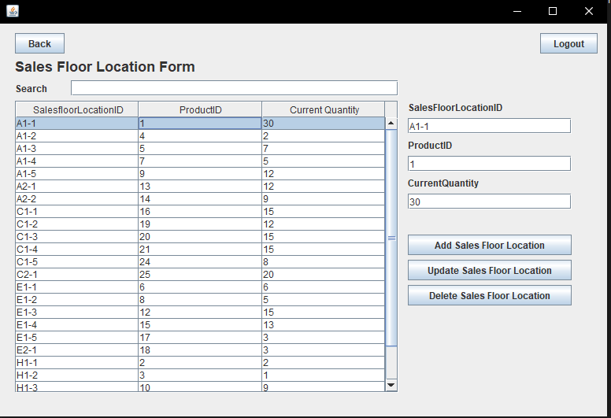
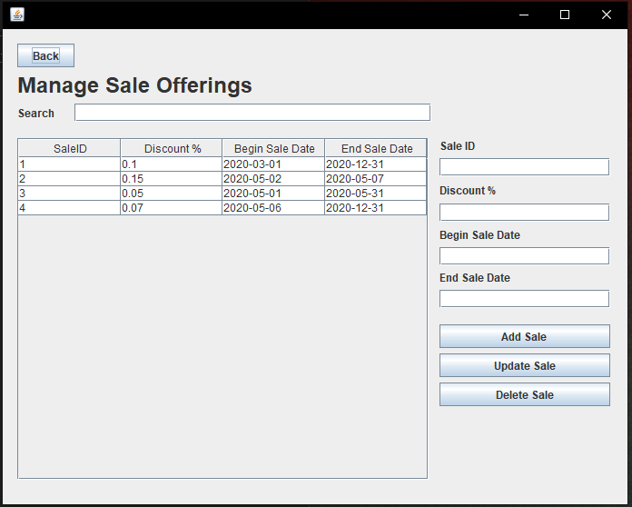
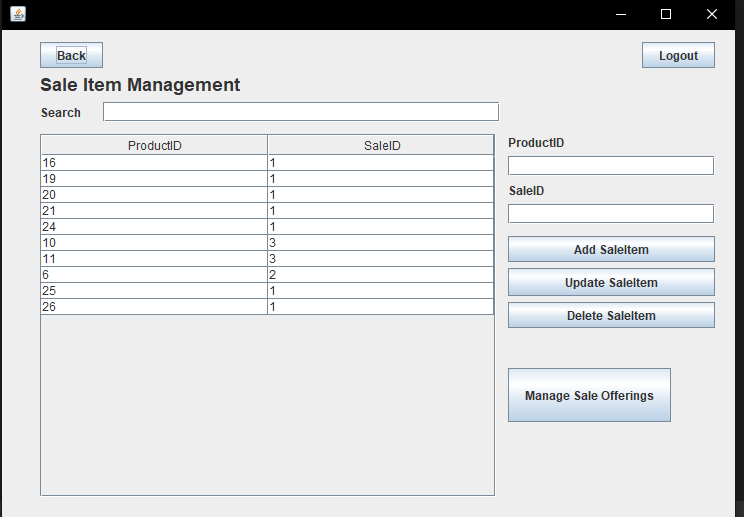
